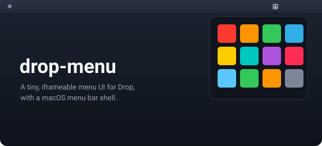

<div align="center">

# drop-menu

**A tiny, iframeable menu UI for Drop, with a macOS menu bar shell.**

A single-file web widget plus a sub-100-line Swift wrapper that puts your Drop items one click away in the menu bar.

[](LICENSE)




</div>

## Why

The main [Drop](https://github.com/bunlongheng/drop) app is the full experience: drag-drop,
paste, search, delete, modals, history. `drop-menu` is the opposite. It is a tiny,
read-only window into the same data, built to live where the full UI is too heavy: a menu
bar, a sidebar widget, or an embedded panel inside another product. Keeping it in its own
repo means the full Drop app can evolve freely, and any product can iframe the widget
without pulling in Next.js, Tailwind, or React.

## Features

- Single-file vanilla HTML and JS web widget, iframeable anywhere
- macOS menu bar shell in under 100 lines of Swift
- Reads any Drop server via a `?api=` query param, so one widget works against any instance
- Live updates over WebSocket, with automatic polling fallback every 4 seconds
- Lazy content loading via `IntersectionObserver`, so the grid appears instantly
- `postMessage` events let the parent own navigation and hide-on-leave
- Read-only by design: it lists items, never uploads, deletes, or modifies
- No frameworks, no bundler, no npm in the web widget

## Repo layout

```
drop-menu/
├── README.md
├── web/
│   └── index.html       # iframeable menu page (vanilla HTML + JS)
└── native/
    ├── build.sh         # compiles the DropMenu binary
    ├── DropMenu.swift    # menu bar app source
    └── DropMenu          # built binary (gitignored)
```

The web page is the reusable part. The Swift app is a thin wrapper that gives you a menu
bar entry point.

```
┌──────────────────────┐
│  parent app / Swift  │
│  ┌────────────────┐  │
│  │ web/index.html │──┼──► GET /api/drop ──► your Drop server
│  │   (iframe)     │  │
│  └────────────────┘  │
└──────────────────────┘
```

## Install

Clone the repo. There are no npm dependencies.

```bash
git clone https://github.com/bunlongheng/drop-menu
cd drop-menu
```

Building the native app requires the Xcode Command Line Tools and macOS 13 or newer:

```bash
xcode-select --install
```

You also need a running Drop server (local or remote) for the menu to read from.

## Quick start

### Web (standalone)

Serve `web/index.html` from any static host and open it, pointing `?api=` at your Drop server:

```bash
cd web
python3 -m http.server 4445
# then open http://localhost:4445/?api=http://localhost:4321
```

### Native (macOS menu bar)

```bash
cd native
./build.sh
DROP_URL=http://localhost:4321 ./DropMenu &
```

`build.sh` produces a single binary, `native/DropMenu`, next to the source. No bundle and
no signing are required for personal use.

What it does:

- Sits in the menu bar with the system `arrow.down.to.line` icon (a template image that adapts to light and dark)
- Opens a 360x480 popover with the menu grid on click
- Auto-hides when the mouse leaves the popover area
- Shows no Dock icon (`activationPolicy = .accessory`)
- Loads `web/index.html` in a `WKWebView` and passes `DROP_URL` through as `?api=`

## Usage

### iframe embed

Serve `web/index.html` from any static host (Vercel, Netlify, S3, `python3 -m http.server`,
and so on), then embed it:

```html
<iframe src="https://your-host.example.com/?api=https://your-drop-server.example.com"
        width="360" height="480" frameborder="0"></iframe>
```

#### Query params

| Param | Default | Description |
|---|---|---|
| `api` | the configured Drop server URL | Drop server base URL (no trailing slash) |
| `channel` | `default` | Channel name to display |

#### postMessage events

The iframe emits these events on `window.parent`:

| Event | Payload | When |
|---|---|---|
| `drop:open` | `{ type, id, api }` | A tile was clicked. Open the full Drop UI, or do whatever you want |
| `drop:mouseleft` | `{ type }` | The mouse left the iframe. The parent can hide or close the menu |

```js
window.addEventListener("message", e => {
  if (e.data.type === "drop:open") {
    window.open(`${e.data.api}/?focus=${e.data.id}`, "_blank");
  } else if (e.data.type === "drop:mouseleft") {
    closeMyMenu();
  }
});
```

#### Configuration

| Env var | Used by | Description |
|---|---|---|
| `DROP_URL` | `native/DropMenu` | Drop server base URL passed to the web widget as `?api=` |

## How it works

The widget fetches item metadata, renders a tile grid instantly, then streams thumbnails
in as you scroll using an `IntersectionObserver`. It connects to
`${api}/ws?channel=${channel}` for live WebSocket push and falls back to polling every 4
seconds if the socket fails, so new drops appear without a refresh. The native shell
simply loads that same page in a `WKWebView` popover anchored to a menu bar item.

### Drop API used

The menu only reads. It never writes.

| Method | Endpoint | Used for |
|---|---|---|
| `GET` | `/api/drop?channel=default` | List items (metadata only, no content) |
| `GET` | `/api/drop?id=<uuid>` | Fetch full content for one item (lazy, on scroll) |
| `WS` | `/ws?channel=default` | Live push when a new drop arrives |

See [`DROPZONE_API.md`](https://github.com/bunlongheng/drop/blob/main/DROPZONE_API.md) in
the parent Drop repo for full API details.

### CORS requirement

Because the menu loads from another origin (or from `file://` in the native app), the Drop
server must send permissive CORS headers on `/api/drop` so the widget can fetch data. The
upstream `drop` repo handles this in its `next.config.ts`. If the menu shows
"Cannot reach ...", check that the Drop server is sending those headers.

## License

[MIT](LICENSE)
